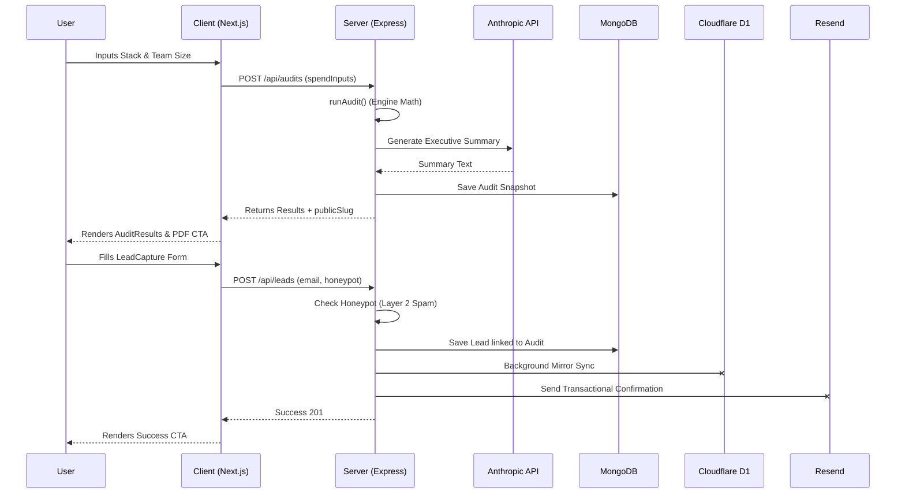

# Architecture & System Design

## System Diagram (Data Flow)

## Stack Justification
**Frontend: Next.js 16 (React) + Tailwind + shadcn/ui**
- Chosen for its App Router, making the dynamic `app/audit/[slug]` route highly performant while natively supporting Server-Side rendering for dynamic Open Graph metadata (critical for the viral loop requirement). 
- Tailwind + glassmorphism UI enables the "Techvruk ditto" aesthetic to look highly premium, which is necessary for a tool targeting finance/leadership.

**Backend: Express.js (Node) + MongoDB + Cloudflare D1**
- Express handles the complex audit math and LLM integrations off the client, keeping API keys totally secure. 
- MongoDB is the primary datastore for flexible schema rapid iteration.
- Cloudflare D1 is integrated via a fire-and-forget sync to demonstrate scalable edge-database architecture.

## Scaling to 10k Audits/Day
If this tool scaled to 10,000 audits per day, the current architecture would face two bottlenecks:
1. **LLM Latency & Cost:** Generating 10k summaries via Anthropic API directly in the request lifecycle would lead to high latency and rate limits. **Solution:** We would implement a caching layer (Redis) to hash identical `spendInputs` and return cached LLM summaries. 
2. **Database Write Locks:** **Solution:** The synchronous MongoDB writes for `Audit` and `Lead` models would be offloaded to an async message queue (e.g., SQS or RabbitMQ). The API would return a `202 Accepted` and optimistic UI updates, while workers process the heavy database writes and transactional emails in the background.
